## Überblick  {.smaller .center}

```{r }
#| label: libraries
#| echo: false

# z.B. library(tidyverse)
```

- Evidenzinformierte Schulpraxis
- Studie 1: Confirmation Bias vs. Belief Updating
- Studie 2: Practical Significance Bias?
- Ausblick: Weitere Befunde zur Effektstärken-<br>kommunikation
- Referenzen


::: notes

- eher neuere Studien ausgewählt, die aber teilweise noch in der Erhebung sind 
- klassischer Aufbau, wobei ich mich eher für einen Ausblick am Ende statt einer übergreifenden Diskussion - dann gemeinsam

:::

## Informationsquellen  

::: .r-stack

::: fragment
<div style="position: absolute; top: 75px; left: 20px;">
{width="200"} 
</div>


::: 

::: fragment
<div style="position: absolute; top: 270px; right: 80px;">
{width="370"} </div>
:::

::: fragment
<div style="position: absolute; top: 400px; left: 230px;">
![Wissenschaftliche Evidenz [@adesope2017]](img/Paper_Retrieval%20practice.png){width="270"} 
</div>
:::

:::
  
::: notes

- professionelles Handeln von Lehrpersonen zeichnet sich u.a. dadurch aus, dass sie bei Entscheidungen auf geeignete Informationsquellen zurückgreifen

- Für situative Entscheidungen kann episodische Evidenz wie z.B. eigene Erfahrungen nützlich sein
  + welche/n Schüler:in rufe ich als nächstes auf (z.B. S., die/der die richtige Antwort mit hoher Wahrscheinlichkeit kennt; S., der/die sich grundsätzlich selten meldet)
- um gezielte individuelle Unterstützungsmaßnahmen für SuS zu formulieren, Lernverlaufsdiagnostik hilfreich; kann Lehrperson kann dabei auf Daten zurückgreifen
- wissenschaftliches Wissen hingegen kann Lehrpersonen in z.B. konzeptuelle Entscheidungen in der Unterrichtsplanung unterstützen
  + z.B. zur Untersützung beim Lernen auf Klassenarbeit: Probetest 

- Rückgriff auf wissenschaftliche Evidenz wird als EISP
:::
  
## Evidenzinformierte Schulpraxis  {.smaller}

::::::: columns
:::: {.column width="50%"}

{width="90%" fig-align="center"}
::::

:::: {.column width="50%"}
::: fragment
<br> <br> <br> <br> Evidenz = systematisch gewonnene Information [z.B. @bromme2014; @shavelson2021; @doering2016]
:::
::::
:::::::

::: fragment
<center> Steigerung der Professionalisierung von Lehrpersonen, der Schul- und Unterrichtsqualität und Schüler:innenleistung <br> [z.B. @bell2010; @double2020; @filderman2018; @coldwell2017; @kennedy2017]</center>
:::

::: notes

- diese Festlegung kann beispielsweise kognitionspsychologisch begründet werden
  + Information wird systematisch nach bestimmten Kriterien gewonnen und ist dadurch weniger von kognitive Verzerrungen beeinflusst und eignet sich daher um fundierte Entscheidungen zu treffen 

<!--
- Kompetenztheoretische Begründung
 +  Kenntnisse wissenschaftlicher Theorien und Befunde ist Voraussetzung für erfolgreichen Unterricht (z.B. Baumert & Kunter, 2006)
 + Diese Perspektive hat u.a. Eingang in die Standards zur Lehrerbildung gefunden (KMK, 2004, S. 289): »Lehrerinnen und Lehrer \[...\] nutzen Ergebnisse der Bildungsforschung für die eigene Tätigkeit« 
--> 
- Evidenz wird daher Potenzial zugeschrieben
  + Professionalisierung von Lehrpersonen zu stärken
  + Unterrichts- und Schulqualität
  + letztlich Schüler:innenleistung zu steigern
(- was auch mit ersten empirischen Studien belegt werden kann)


:::

## Idealtypischer Prozess evidenzinformierten Handelns {.smaller}

<center>
_adapted.png){.lightbox width="50%" fig-align="center"}
</center>

::: fragment
<center>
[]{style="color:#96412D;"} Idealtypischer Prozess []{style="color:#96412D;"} Umsetzung durch Lehrpersonen []{style="color:#96412D;"}
</center>
:::

::: notes

- evidenzinformiertes Handeln komplex und mehrschrittig - hier abgebildet
  + nicht im Detail, aber zeigt sich, dass Anlass über Recherche hin zum Verstehen und Anwenden

- wie Sie sicherlich wissen: gibt es aber eine Kluft zwischen diesen theoretischen Implikationen und der tatsächlichen Praxis
- Lehrpersonen greifen kaum auf Evidenz in ihrem professionellen Handeln zurück

::: 

## Katalysatoren und Barrieren  {.smaller}


> Verschiedene Einflussfaktoren, die je nach Ausprägung als Katalysatoren oder Barrieren wirken [vgl. z.B. systematische Reviews von @dagenais2012; @hemsley-brown2003; @schmidt2024; @schaik2018]

::: fragment
<center>
_adapted_Zeit.png){.lightbox width="55%" fig-align="center"}
</center>

::: 


::: notes
- Blickt man in die Forschung zeigt sich, dass Einflussfaktoren sehr vielfältig sind und in den verschiedenen Phasen zum Tragen kommen 
- je nach Ausprägung wirken sie als Katalysatoren oder Barrieren
- ich möchte ein paar Beispiele geben
  + häufige Barriere, die Lehrpersonen benennen ist die limitierte Zeit, die alle Phasen des Prozesses betrifft

:::


## Katalysatoren und Barrieren  {.smaller}


> Verschiedene Einflussfaktoren, die je nach Ausprägung als Katalysatoren oder Barrieren wirken [vgl. z.B. systematische Reviews von @dagenais2012; @hemsley-brown2003; @schmidt2024; @schaik2018]

<center>
_Evidenzaufbereitung.png){.lightbox width="55%" fig-align="center"}
</center>

::: notes

- Aufbereitung: während Knowledge Brokers wie Clearinghouses, versuchen wissenschaftliche Evidenz für Praktiker:innen frei zugänglich zu machen
 Gestaltung der Evidenz oftmals Barriere: Forschungserkenntnisse häufig durch zahlreiche Fachbegriffe gekennzeichnet z.B. statistische Fachtermini schwer verständlich

    
:::


## Katalysatoren und Barrieren  {.smaller}


> Verschiedene Einflussfaktoren, die je nach Ausprägung als Katalysatoren oder Barrieren wirken [vgl. z.B. systematische Reviews von @dagenais2012; @hemsley-brown2003; @schmidt2024; @schaik2018]

<center>
_Überzeugungen.png){.lightbox width="55%" fig-align="center"}
</center>

::: notes

- Außerdem verfügen Lehrpersonen oftmals über Überzegungen, die je nachdem förderlich oder hinderlich sind und teilweise dazu führen können, dass Prozess gar nicht erst gestartet wird

- zoomt man aus diesem Prozess heraus kann man diese verschiedenen Einflussfaktoren auch auf einer Metaebene systematisieren

- die Katalysatoren und Barrieren können auch ...

::: 

## Katalysatoren und Barrieren {.smaller}


> Einflussfaktoren, die je nach Ausprägung als Katalysatoren oder Barrieren wirken, können der __Seite der Nutzenden__ oder der __Seite des Angebots__ zugeordnet werden [@schmidt2024]

<center>
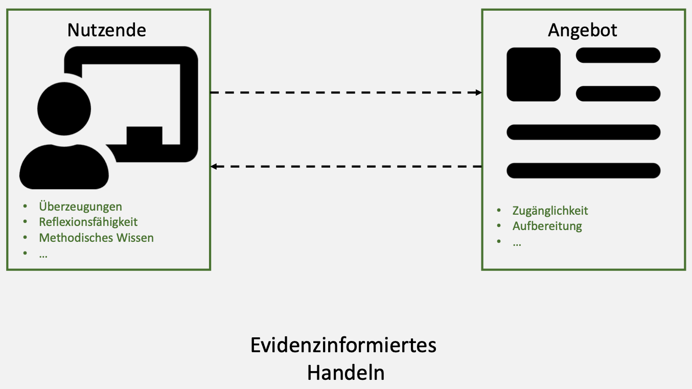{.lightbox width="50%" fig-align="center"}
</center>

::: notes
... der Angebots oder Nutzenden-Seite zugeordnet werden

- Nutzendenseite bezieht sich auf die Ausstattung der (angehenden) Lehrpersonen - evidenzinformiertes Handeln erleichtern
  - bspw. über welche Überzeugungen Lehrpersonen verfügen
  - oder ihr forschungsmethodisches Wissen
- Angebot bezieht sich auf die wissenschaftliche Evidenz
  - Aufbereitung durch Forschende oder Schnittstellen sogenannte Knowledge Brokers wie Clearing Houses
  - z.B. ihre Zugänglichkeit und ihre Aufbereitung
- Zudem können sich beide Seiten gegenseitig beeinflussen
  + Beispiel: Graph literacy könnte durch ein gut gemachtes Angebot mit z.B. Hervorhebungen, die die Aufmerksamkeit auf wichtige Infos lenkenerhöht werden
- Daher kann man die Umsetzung EISP auch als Interaktion zwischen Angebot und Nutzung verstehen
- mit dieser Heuristik auf unsere Forschungsstudien blicken

::: 

## Studie 1: Confirmation Bias vs. <br> Belief Updating *(Nutzendenseite)*

<br>

<center>

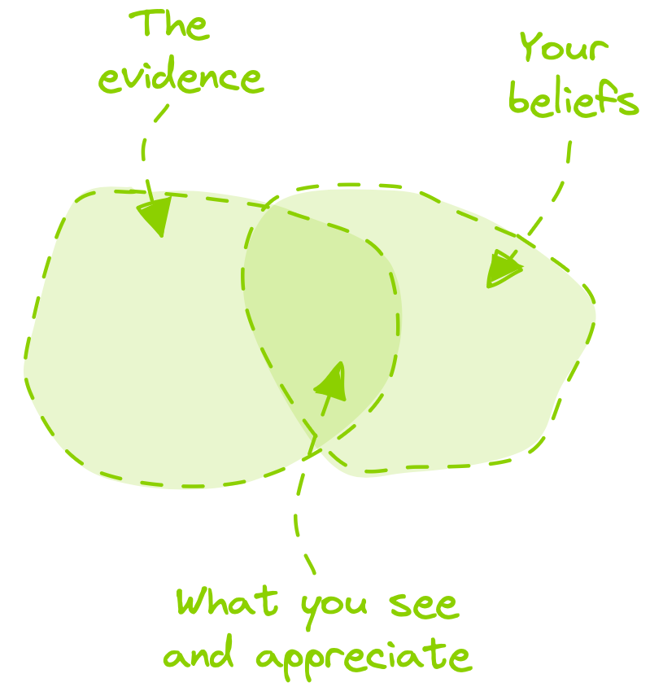{width="300"}

[gemeinsam mit Samuel Merk]{style="font-size: .7em; display: block;"}

</center>

::: notes
- starten mit der Nutzendenseite
- wir wissen aus bisherige Forschung dass bildungswissenschaftliche Fehlkonzepte - also evidenzwidrige Überzeugungen - weit unter Praktiker:innen verbeitet sind, aber schwer aufzulösen sind 
- daher fokussiert wie Lehrpersonen Evidenz in Abhängigkeit Ihrer Überzeugungen beurteilen und was Evidenz mit ihren Überzeugungen macht


:::

## Bestätigungsfehler {.smaller}

<!-- &#x2011; ist der "no linebreak hyphen" - sonst bleibt nur das Minus in der Zeile -->

- Bestätigungsfehler (engl. *Confirmation Bias*) = Vorabüberzeugungen verzerren die Suche, Interpretation und Erinnerung von Informationen [e.g., @hart2009; @nickerson1998; @oswald2004; @stroud2017]
  - Informationen, die **kongruent zu eigenen Überzeugungen** sind, werden bevorzugt, als valider wahrgenommen und schneller erinnert.
  - Informationen, die **inkongruent zu eigenen Überzeugungen** sind, werden schneller abgewertet, hinterfragt, auf Fehler untersucht und schlechter erinnert.

- Die Überzeugungen von (angehenden) Lehrpersonen beeinflussen...
  - ... ihre Evaluation von wissenschaftlichen Studien [@masnick2009]
  - ... ihr Vertrauen in bildungswissenschaftliche Aussagen [@schmidt2022]
  - ... ihre Beurteilung der Aussagekraft bildungswissenschaftlicher Ergebnisse [@futterleib2022; @thomm2021a]
  
::: incremental
- []{.imp2} Allerdings passen Studierende ihre Überzeugung an überzeugungsinkongruente Evidenz an [@futterleib2022; @thomm2021a]
:::


::: notes

- zentrales Schlagwort dabei ist der Bestätigungsfehler (ConfBias) 
- ConfBias meint, dass unsere bestehenden Überzeugungen beeinflussen wie wir Infos sucht, interpretiert und erinnert
- Confbias hat verschiedene Komponenten - fokussiere mich jetzt auf das Interpretieren
  + genauer, bedeutet ConfBias hier, dass man Informationen, die zur eigenen Überzeugung passen als valider/aussagekräftiger/überzeugender wahrnimmt
  + wohingegen Infos, die nicht kongruent zu den eigenen Überzeugungen sind schneller abwertet, in Frage stellt
  
- viel Forschung zu ConfBias, die die Existenz in verschiedenen Kontexten belegt, aber im Bildungsbereich wenig Forschung, die in unterschiedliche Richtung deutet 
  + verschiedene Studien deuten darauf hin, dass ConfBias in Buerteilung der Evidenz vorliegt
  + um ein Beispiel zu geben: aktive Lehrpersonen vertrauen Aussagen aus der Bildungswissenschaft weniger, wennn diese inkongruent - also nicht passend - zu ihren Überzeugungen sind im Vergleich zu solchen, die zu ihren Überzeugungen passen
  + Aber überraschenderweise zeigen zwei Studien, dass Lehramststudierende dennoch ihre Überzeugungen an die überzeugungswidrige Evidenz anpassen
  
- Daher wollten wir sehen, inwieweit wir diese Diskrepnz zwischen verzerrter Beurteilung der Evidenz und Belief-Updating konzeptuell replizieren können
   
  
::: 

## Forschungsfragen  {.smaller}

**Forschungsfrage 1:** Inwieweit beeinflusst die (In)Kongruenz zwischen Überzeugungen und Evidenz Lehramtsstudierende in ihrer Bewertung von Studienergebnissen?

<br>

**Forschungsfrage 2:** Inwieweit passen Lehramtsstudierende ihre Überzeugungen an die Evidenz an?

<br>

**Forschungsfrage 3:** Inwieweit beeinflusst die (In)Kongruenz zwischen Überzeugungen und Evidenz Lehramtsstudierende in ihrer Überzeugungssicherheit?

::: notes

- Daher haben wir folgende Forschungsfragen aufgestellt. Inwieweit ...
 1) ... beeinflusst die (In)Kongruenz zwischen Überzeugung und Evidenz Lehramtsstudierende in ihrer Beurteilung der Studienergebnisse?
 2) ...  sie Ihre Überzeugung - also die Richtung der Überzeugung - an die Evidenz anpassen?
 3) ... die (In)Kongruenz der Überzeugung und Evidenz Lehramtsstudierende in Ihrer Überzeugungssicherheit beeinflusst - wenn Sie die Überzeugungsrichtung nicht ändern?
::: 

## Stichprobe  {.smaller}

- *N* = 526 Lehramtsstudierende
- 83,08 % der Studierende sind weiblich
- 68,25 % der Studierende sind im zweiten Semester
- 67,11 % der Studierende studieren Lehramt der Primarstufe
- 57,98 % der Studierenden studieren mindestens ein Fach im sprachlichen Bereich
- 61,03 % aller Studierende sind zu Beginn der Studie davon überzeugt, dass die Verwendung der rein männlichen Form zu keiner überproportionalen Assoziation mit männlichen Schülern führt.

::: notes

- 526 Lehramtsstudierende mit unterschiedlichen Hintergründen - auch akademischen Hintergründen

::: 

## Design, Materialien und Variablen  {.smaller .scrollable}

- Between-person Design mit dem 2-stufigen Experimentalfaktor *(In)kongruenz zwischen Überzeugung und Evidenz*

- Thema "Gendergerechte Sprache in der Schule"

  <center>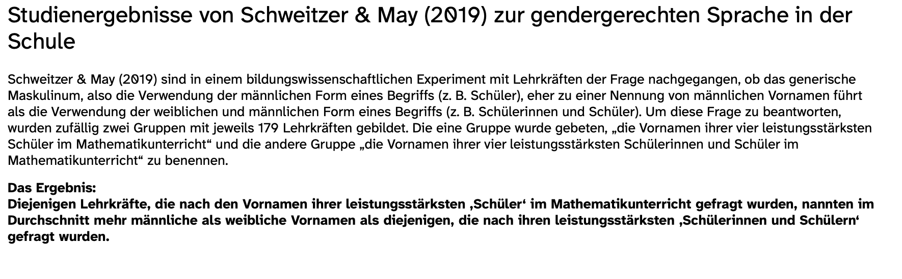{.lightbox width="600"}</center>

- Abhängige Variablen

  - *Überzeugungsrichtung*: <br>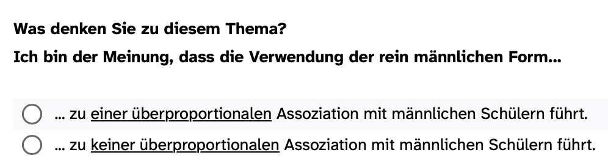{.lightbox width="500"}
  - *Überzeugungssicherheit*: <br> 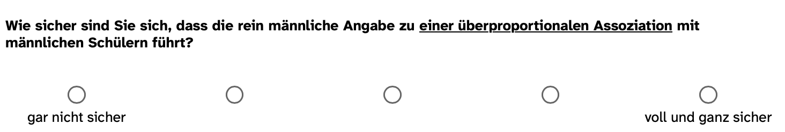{.lightbox width="500"}
  - *Beurteilung der Studie*: <br> 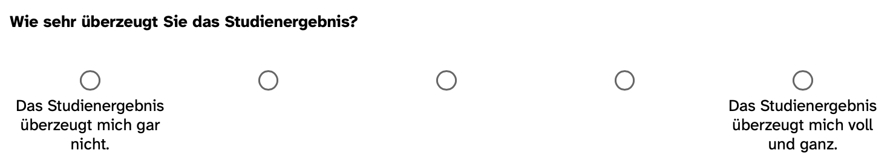{.lightbox width="500"}


::: notes

- unser Experiment war ein between-person Experiment, gerahmt durch das Thema gendergerechte Sprache in der Schule gerahmt
- im Vordergrund stand die Frage, ob das generische Maskulinum zu einer überproportionalen Assoziation mit männlichen Schülern führt - male bias
- erst haben die Studierende ihre Überzeugung zu diesem Thema angeklickt
- und abhängig von Ihrer Überzeugung, wurden sie dann danach gefragt wie sicher sie sich sind
- dann erhielten die Teilnehmenden einen solchen Forschungsbericht, in dem eine experimentelle Studie zum Thema male bias vorgestellt wurde. 
  + Forscher:innen wollten wissen, ob Lehrpersonen mehr männliche Vornamen nennen, wenn sie nach den leistungsstärksten Schüler vs. Schülerinnen und Schüler fragen. 
  + Forschungsbericht war immer gleich aufgebaut, lediglich zwei verschiedene Versionen der Ergebnisse: Studie die Existenz des male bias stütze oder nicht
  + experimentelle Manipulation, also ob Gruppe überzeugungskongruente und -inkongruente war Zusammenspiel auf Überzeugung und Evidenz
  + Beispiel: Person X geht nicht von einem Male Bias aus ist in der Experimentalgruppe __überzeugungsinkongruente Evidenz__, dann diesen Forschungsbericht mit dem Ergebnis, das mehr männliche als weibliche Vornamen genannt wurden. Aber auch eine Person, die von der Existenz des male bias überzeugt ist und in Experimentalgruppe "überzeugungskongruente Evidenz" ist, erhält diesen Bericht.

- Nach dem Lesen sollten die Studierenden die Studie beurteilen - auf einer fünfstufigen Likert-Skala wie überzeugend sie das Studienergebnis fanden
- und zum zweiten Mal Überzeugungsrichtung und Sicherheit angeben

- kommen wir zu den Ergebnissen

::: 

## Ergebnisse: Beurteilung der Studie 

<center>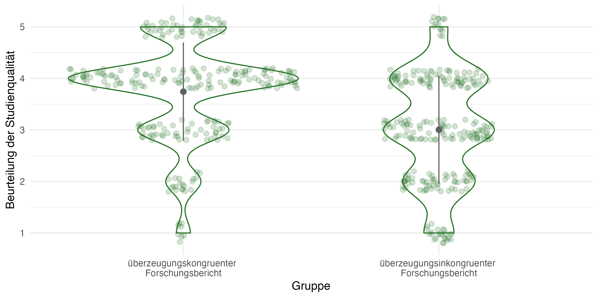{.lightbox}</center>

<!-- Farbe anpassen in Visualisierung -->


::: notes

- nun zur ersten FF, inwieweit die (In)Kongruenz zwischen Überzeugung und Evidenz die Beurteilung der Studienergebnisse beeinflusst
- x- und y-Achse erklären 
  + Lehramtsstudierende, die mit überzeugungskongruenten Ergebnissen konfrontiert sind, schätzen die Ergebnisse überzeugender ein als diejenigen, die überzeugungsinkongruente Ergebnisse sichten
  + große Effekt - mit Bayesianischer Inferenzstatistik abgesichert

::: 

## Ergebnisse: Updating der Überzeugungsrichtung 

<center>{.lightbox}</center>

<!-- Anpassen: kongruent statt konsistent-->

::: notes

- nun zur Forschungsfrage 2, also Updating der Überzeugungsrichtung
- in den zwei Teilgrafiken sehen sie die zwei Experimentalgruppen
- hellgrün hinterlegt markiert alle Studierenden, die bei ihrer Überzeugung bleiben und dunkelgrün, diejenigen die Ihre Überzegung updaten
  + deutlich sichtbar, dass Mehrheit bei Überzeugung bleibt - auch in der Experimentalgruppe "überzeugungsinkongruente Evidenz" 
  + Beispiel <!-- 133 Studierende, die vor Sichtung der Evidenz davon überzeugt waren, dass ein Male Bias nicht existiert - Prä-Überzeugung = 2, bleiben auch nach Sichtung überzeugungsinkongruenter Evidenz dabei, dass ein solcher Bias niucht existiert -->
  + Umgekehrt 27 Personen, die eingangs dachten, dass male bias nicht existiert, passten ihre Überzeugung an die Evidenz an, d.h. nach Sichtung sind sie überzeugt, dass Male Bias existiert 
 + Evidenz aktuel noch inkonklusiv
 
:::

## Ergebnisse: Updating Überzeugungssicherheit   {.smaller}

<center>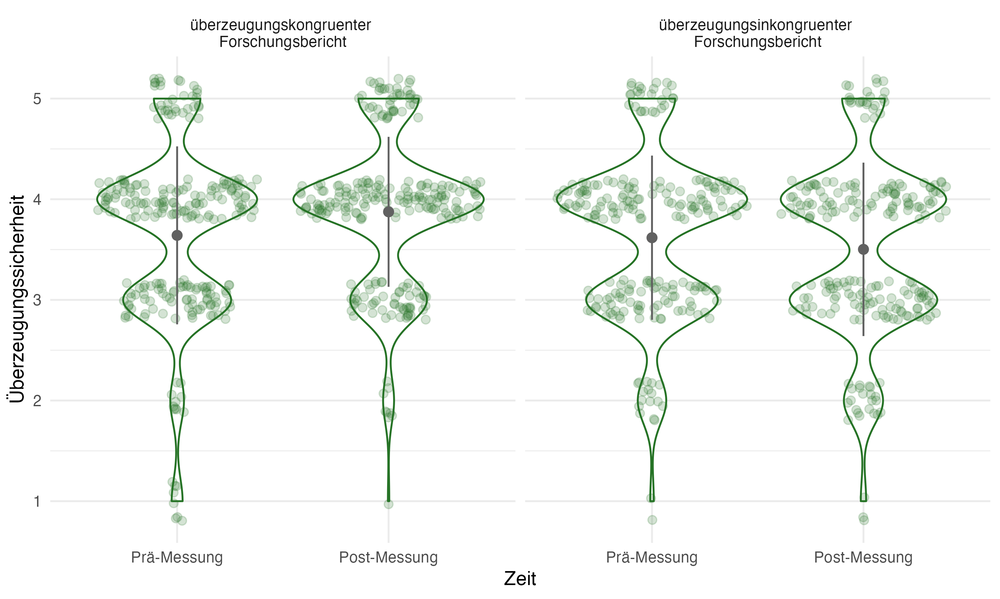{.lightbox width="800"}</center>

<!-- Farbe anpassen in Visualisierung -->


::: notes

- Fokussiert man die Forschungsfrage 3, können wir sehen, dass die Überzeugungssicherheit der Lehramtsstudierenden, die überzeugungskongruente Evidenz sichten, steigt
- Studierende, die überzeugungsinkongruente Evidenz sichten, ihre Überzeugungsrichtung nicht geändert haben, sind aber weniger sicher in ihre Überzeugung 
- moderater/kleiner Effekte, inferenzstatistisch abgesichert

:::


## Zentrale Erkenntnisse 

- Lehramtsstudierende beurteilen wissenschaftliche Evidenz basierend auf ihren Überzeugungen
- Lehramtsstudierende, die überzeugungsinkongruente Evidenz lesen, passen nicht ihre Überzeugungsrichtung, aber ihre Überzeugungssicherheit an
  + Lehramtsstudierende scheinen nicht unreflektiert an ihren Überzeugungen festzuhalten
  + Grad der Anpassung könnte von verschiedenen Faktoren (z.B. Thema, Anzahl an Forschungsberichten) abhängen
  
::: notes

- zusammenfassend: Diskrepanz konzeptuell repliziert
  + Lehramtsstudierenden beurteilen Evidenz unterschiedlich je nachdem ob diese ihrer Überzeugung entspricht oder widerspricht. Barrier für EIP -> Umgang mit Evidenz nicht automatisch informiertere Entscheidungen
  + Ziel: Lehramtsstudierende in Evaluation von Evidenz unterstützen, um Einfluss der Überzeugungen zu reduzieren 
- in unserer Studie kaum Anpassung ihrer Überzeugungsrichtung, aber Überzeugungssicherheit verändert sich nach Sichtung der Evidenz
    + scheinen also auch bei uns nicht "unreflektiert" an Überzeugung festzuhalten
    + Unterschied zu bisherigen Studien: wir haben nur eine Studie präsentiert, vorher verschiedene Studien zum gleichen Thema
    + möglicherweise Grad des Updating von verschiedenen Faktoren - wie Anzahl der Studien, Thema selbst - abhängig
  + zentrale Frage, die abschließend ohne Antwort in den Raum stellen möchte: was ist eigentlich eine angemessene Reaktion nach Sichtung der Evidenz, denn wir verfolgen auch nicht das Ziel, dass blind in Forschung vertraut wird 
    
- mit dieser Frage die Perspektive wechseln / zur anderen Seite der Medaille 

::: 


## Studie 2: Practical Significance Bias? <br> *(Angebot von Evidenz)*

<br>
<center>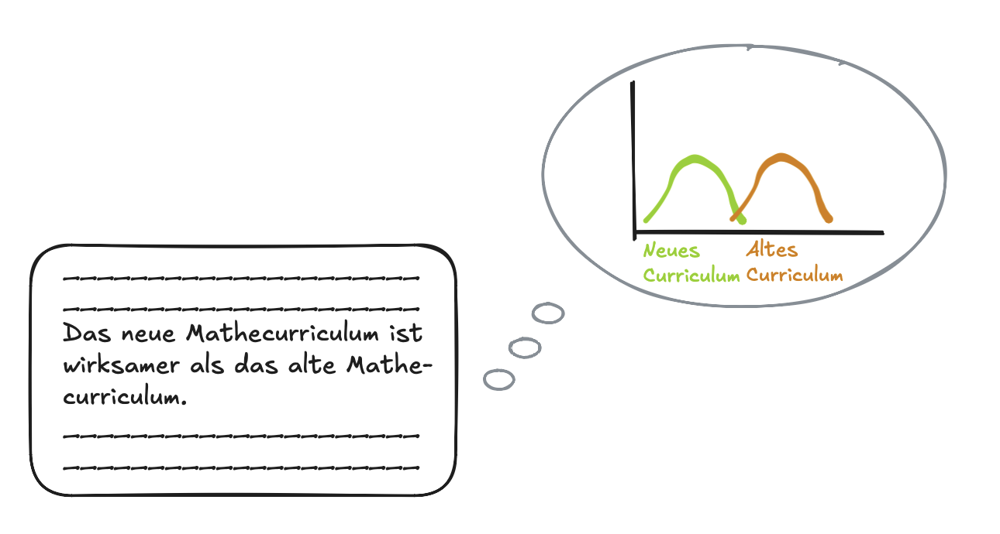{width="500"}</center>

<center>gemeinsam mit Samuel Merk und Florian Kühlwein</center>

::: notes
- Angebot, genauer Gestaltung von WK
- eine aktuelle Studie mitgebracht, deren Datenerhebung noch läuft 
- untersuchen, wie Forschungsergebnisse kommuniziert werden sollen, genauer ob Effektstärke kommuniziert werden sollten

<!--
- Fokus auf quantitative Studien - soll aber nicht abstreiten, dass Evidenz auch durch qualitative Studien gewonnen wird

-->

::: 


## Kommunikation von Forschungsergebnissen  {.smaller .scrollable}

- Diverse Formate der Wissenschaftskommunikation [@besa2024]
  + Kaum empirische Forschung zu nutzer:innenfreundliche Gestaltung von Wissenschaftskommunikation [z.B. @fitzgerald2022; @lortie2021; @merk2023]
  + Diverse Darstellungsweisen der Forschungsergebnisse: 

<center> 
| | | | |
|--|--|--|--|
|{.lightbox width="160" fig-align="left"}[@knogler2017]|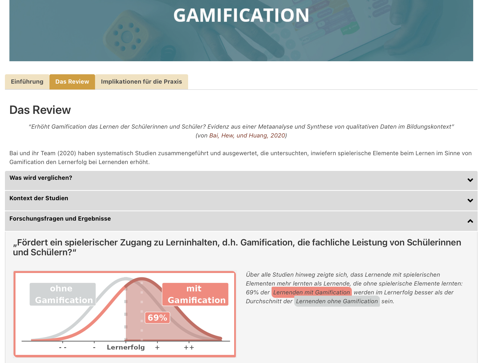{.lightbox width="160" fig-align="left"}[@backfisch2021]|{.lightbox width="160" fig-align="left"}[@rijkhoek2019]|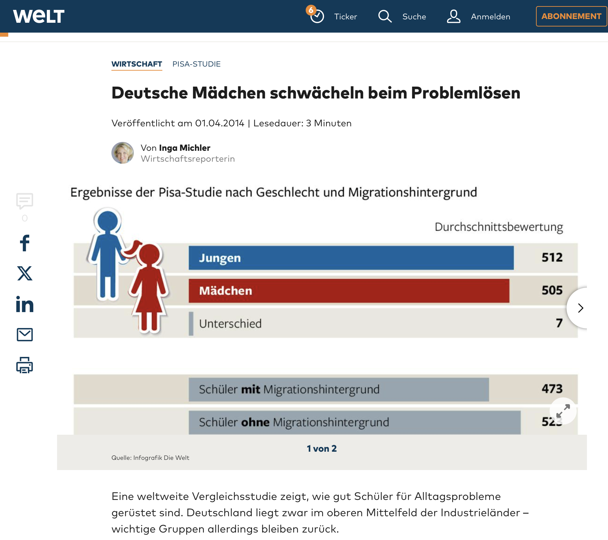{.lightbox width="160" fig-align="left"}[@michler2014]|
</center>

- Verschiedene textliche und visuelle Darstellungen von Effektstärken beeinflussen die Wahrnehmung und Einschätzung von Effektstärken durch (angehende) Lehrpersonen [z.B. @schmidt2023; @merk2023; @kuhlwein2025; @schneider2024]
- Wenn in Forschungsberichten Informationen über Effektstärken fehlen, assoziieren wissenschaftliche Laien automatisch große Effekte (Practical Significance Bias) [@michal2024]

<!-- {.lightbox width="160" fig-align="left"}[@adesope2017]|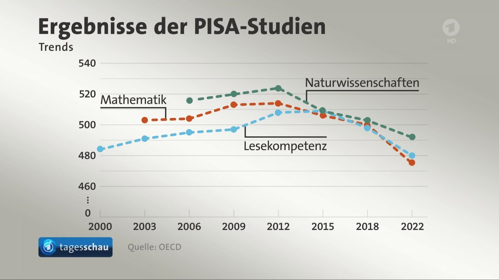{.lightbox width="100"}| -->

::: notes
- Hintergrund ist der
- Wenn man sich aktuell die Landschaft der Wissenschaftskommunikation anschaut sehr divers
  + von Pressemitteilungen, Zeitungsartikel über Podcasts bis hin zu knowledge broker wie CH
  + allerdings kaum empirische Forschung, die untersucht Forschungsergebnisse für die Zielgruppe der Lehrpersonen informativ, praktisch relevant aber dennoch verständlich aufbereitet werden kann
  + spiegelt sich auch in ganz unterschiedliche Ansätze wider
    - Clearinghouses: Effektstärken berichtet z.B. Cohen's d als numerischer Wert, andere eine Transformation von Cohen's d, sogenannte Cohen's U3 (erklären) - verbal, aber auch visuel
    - In Pressemitteilungen oder Abstracts aus Originalstudien  gar keine Information über Effektstärke z.B.  nur die Rede von "Schüler:innen in der vorderen Sitzreihe lösen Matheaufgaben schneller als in der hinteren Sitzteihe" 
    - Zeitungsartikel: Effektgröße im Sinne von Mittelwertsunterschieden, aber ohne Information über Streuung, also keine sogenannten standardisierten Effekt
  + Die wenige Forschung, die existiert zeigt, dass unterschiedliche Darstellung unterschiedlich wahrgenommen und eingeschätzt werden 
  + hervorheben mnöchte ich vor allem ein Ergebnis nämlich, dass eine neuere Studie zeigt, dass fehlende Information von Effektstärken dazu führt, dass automatisch ein großer Effekt assoziiert wird - sogenannten practical significance bias - und bisherige Studien zeigen, dass es Lehrpeson unter geeigneten Darstellung relativ gut gelingt Effektstärken einzuschätzen, Studie erweitert replizieren

::: 

## Forschungsfrage 
<br>
<br>
<center>
Inwieweit weisen Lehramtsstudierende beim Rezipieren von Evidenz einen Practical Significance Bias auf?
</center>


::: notes

- um herauszufinden, inwieweit auch Lehramtsstudierende einem PSB unterliegen
- Erweiterung der Replikation vernachlässige ich heute


:::

## Stichprobe 

- *N* = 211 Lehramtsstudierende
- 68,25 % der Studierende sind weiblich und studieren im zweiten Semester
- 53,55 % der Studierende studieren Lehramt der Primarstufe
- 46,92 % der Studierende studieren mindestens ein Fach im sprachlichen Bereich


::: notes

erneut Lehramtsstudierende mit unterschiedlichen (akademischen) Hintergründen; insgesamt 211

:::

## Design, Materialien und Variablen  {.smaller .scrollable}

- Between-person Experiment mit fünf Experimentalbedingungen (1 = Effektstärke wird nicht präsentiert; 2 = kleine Effektstärke als Text; 3 = große Effektstärke als Text; [4 = kleine Effektstärke als BESD; 5 = große Effektstärke als BESD]{style="color:lightgrey;"})

<center>{.lightbox group="my-gallery" width="300"}</center>

::: {style="display:none"}
{.lightbox group="my-gallery" width="300"} 
:::

- Abhängige Variablen:
  - *Entscheidungsrating*: <br> 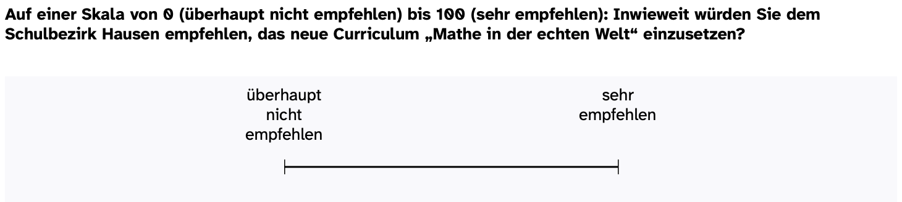{.lightbox width="400"}
  - *Guestimation der Effektstärke:*

|  |  |
|-----------------------------------:|:-----------------------------------|
| Probability of Superiority 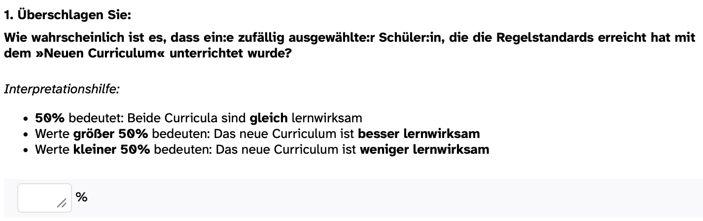{.lightbox width="500"} | Likert-Item 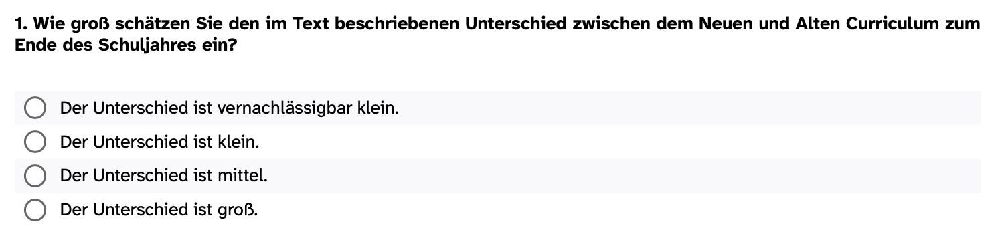{.lightbox width="400"} |


::: notes

- wieder between-person design
- insgesamt 5, aber nur 3 Experimentalbedingungen für heute relevant
- Alle Studierenden erhielten einen solchen Ausschnitt zur Mathekompetenz bei Grundschulkindern. Forscher:innen das alte Curriculum mit einem neuen Vergleichen 
  + dieser Bericht unterscheided sich zufällig darin, wie die Ergebnisse dargestellt werden
    + wie hier keine Effektstärke
    + kleine Effektstärke verbal (wie im Orignal) 
    + große Effekte statt 27, 35%
    + Erweiterung jetzt nicht relevant
- Studierenden sollten dann ein Entscheidungsrating abgeben, auf einer Skala von 0 bis 100 inwieweit sie dem Schulbezirk empfehlen würden das neue Curriculum einzusetzen
- ergänzend zur Originalstudie noch die Einschätzung der Effektstärke abgefragt
  + angelehnt an die sogenannte POS, indem sie angeben sollten wie wahrscheinlich es ist, dass ein zufällig ausgewählte Schülerin, die die Regelstandard erreicht hat, mit dem neuen Curriculum unterrichtet wurde
  + ordinalen Skala
- zusätzlich Ihre Entscheidung begründen (noch nicht ausgewertet)


Kommen wir auch hier - zu den vorläufigen - Ergebnissen
:::


## Ergebnisse: Entscheidungsrating 

<center>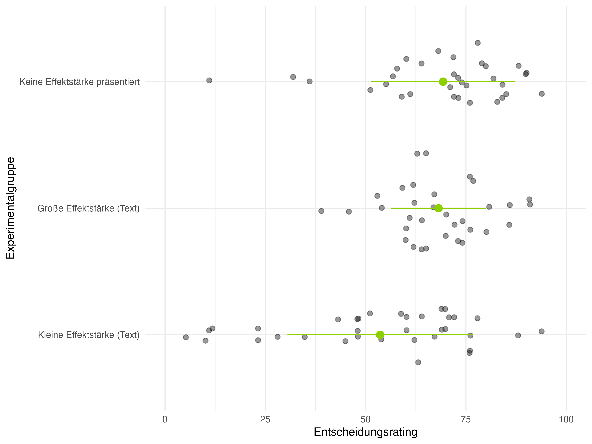{.lightbox width="700"}</center>


::: notes

- rein deskriptiv

- Schauen wir uns zunächst das Entscheidungsrating an, also inwieweit sie das neue Curriculum empfehlen würden
  + x-Achse Rating
  - y-Achse verschiedenen Experimentalgruppen
- fokussieren wir die keine Effektstärke und große Effektstärke-Bedingung, sehen wir kaum Unterschiede im Antwortverhalten, d.h. ähnlich stark empfehlen -> könnte man also deskriptiv als PSB deuten
- wir sehen aber auch, dass die Studierenden zwischen kleiner und großer Effektstärke differenzieren, dass sie das Curriculum im Durchschnitt stärker empfehlen, wenn größere Effektstärke präsentiert wird

::: 


## Ergebnisse: Guestimation I 

<center>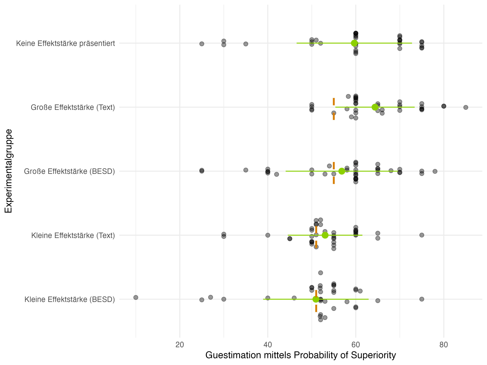{.lightbox width="700"}</center>

::: notes

- hinsichtlich der Einschätzung der Effektstärke, deskriptiv weniger unterschiedlich könnte man sagen
- Einschätzungen sind ohne Angaben zur Effektstärke etwas geringer als bei Bedingung große Effektstärke (Text), aber durchschnittlich größer als bei Bedingung kleiner Effekt.


Ergänzende Note:

- mit BESD akkurater, aber auch mehr, die die Richtung verwechseln
::: 

## Ergebnisse: Guestimation II 

<center>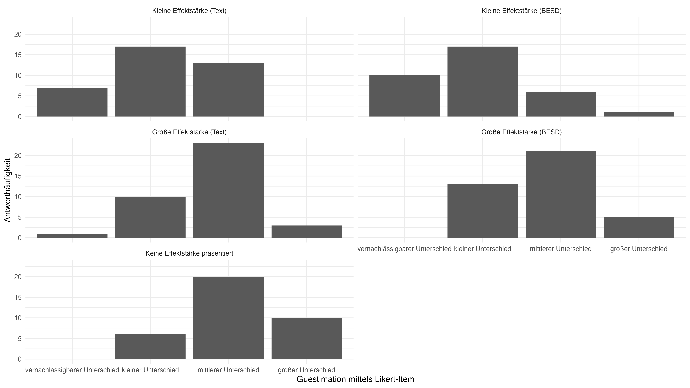{.lightbox}</center>


::: notes

- weitere Operationalisierung: Ergebnisse des Likert Items / oridinal
- auch hier erkennen wir, dass die Antwortverteilung zwischen groß und keine Effektstärke sehr ähnlich ist, bei keine Effektstärke sogar häufiger großer Effekt angekreuzt wird
- wir erkennen aber auch, dass zwischen groß und kleiner Effektstärke differenziert wird


::: 

## Zentrale (vorläufige) Erkenntnisse 
* Practical Significance Bias kann bei Lehramtsstudierenden repliziert werden [@michal2024]
  + Je nach Operationalisierung (Entscheidungsrating vs. Guestimation) unterschiedlich stark ausgeprägt
  + Kommunizieren von Effektstärken als mögliche Gegenmaßnahme 

::: notes
- zusammengefasst deuten die ersten deskriptiven Analysen also darauf hin, dass sich der PSB bei Lehramtsstudierenden replizieren lässt, aber je nach Operationalisierung/Stimuli unterschiedlich stark ausgeprägt ist (Idee thinking fast/slow)
- gleichzeitig auch Gegenmaßnahme deutlich: Kommunizieren von Effektstärke
  + Titel Ergebnisse aus verschiedenen experimentellen Studien angekündigt, daher noch Überblick weitere Forschungsbefunde aus unserer AG


::: 

## Ausblick: Weitere Befunde zur Effektstärkenkommunikation  {.smaller .scrollable}

- Lehrpersonen differenzieren zwischen kleinen und großen Effektstärken [@merk2023; @kuhlwein2025]
- Mit geeigneten Visualisierungen schätzen Lehrpersonen Effektgrößen erstaunlich akkurat ein (Darstellung von Streuung [@merk2023]; Annotationen [@schneider2024]) 

<center> 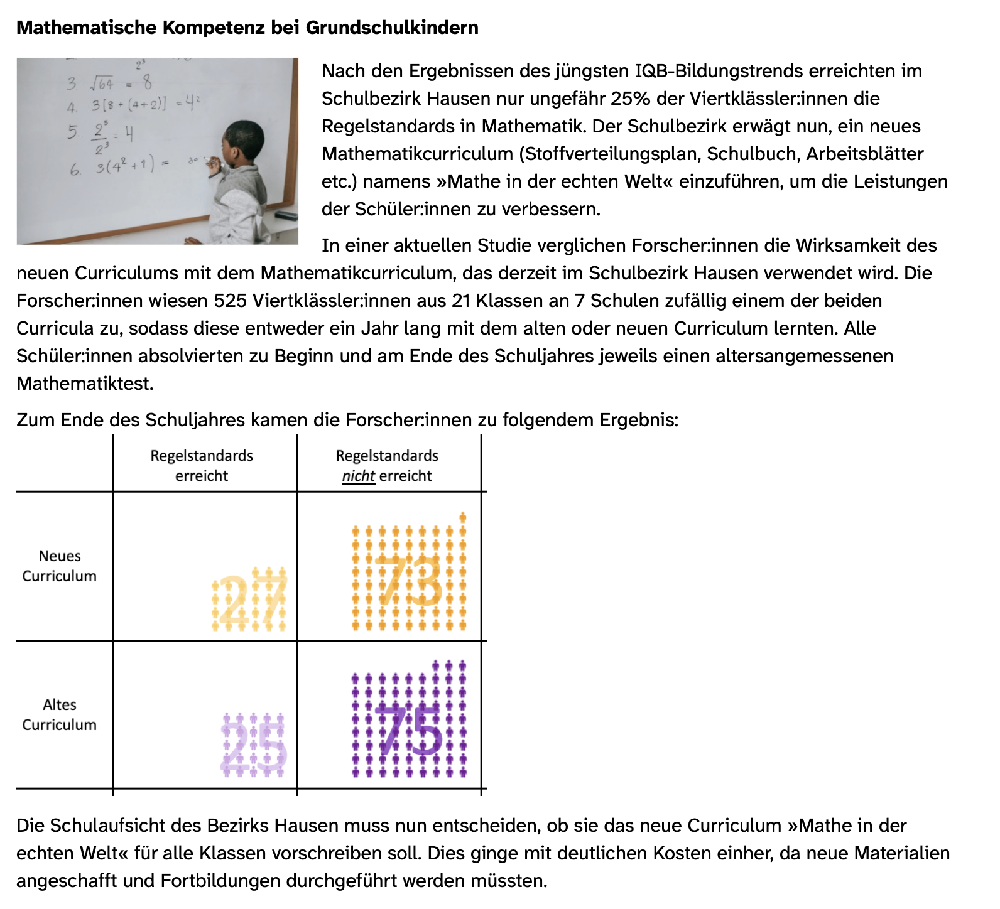{.lightbox group="my-gallery" width="100"} </center>

- ***Common** Language Effect Size* $\nRightarrow$ ***Widely Understood** Effect Size*: 
  + Lehrpersonen weisen Fehlkonzepte z.B. in der Interpretation von Cohens' U3 auf  [z.B. @kuhlwein2025; @schmidt2023; @schneider2024]
  + Lehrpersonen haben (teilweise) Schwierigkeiten Informationen über Effektstärken und Inferenzstatistiken voneinander zu trennen [z.B. @schmidt2023] 
<center> 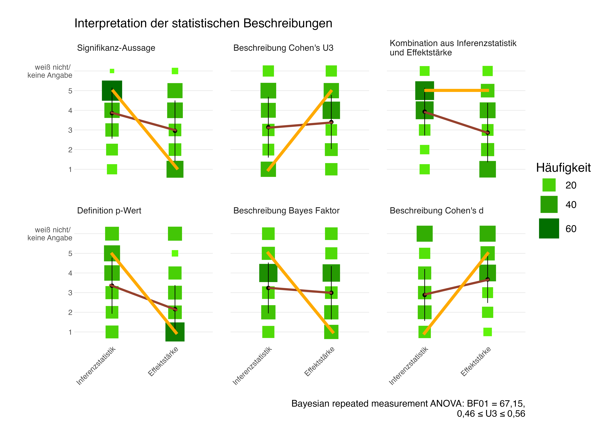{.lightbox width="150"} </center>

- __Text und Bild scheinen komplementäre Vor- und Nachteile zu haben__: Lehrpersonen nehmen Cohen's U3-Formulierungen beispielsweise informativer wahr, schätzen aber visuelle Effektstärkendarstellung (Halfeye-Plots) genauer ein [@kuhlwein2025]

|||
|--|--|
|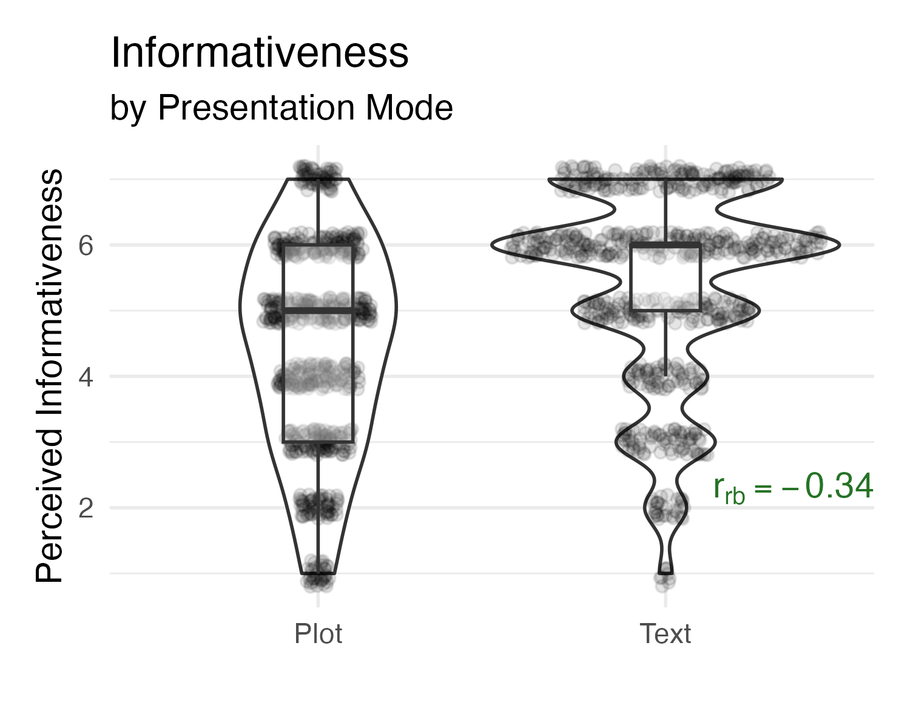{.lightbox width="100"}|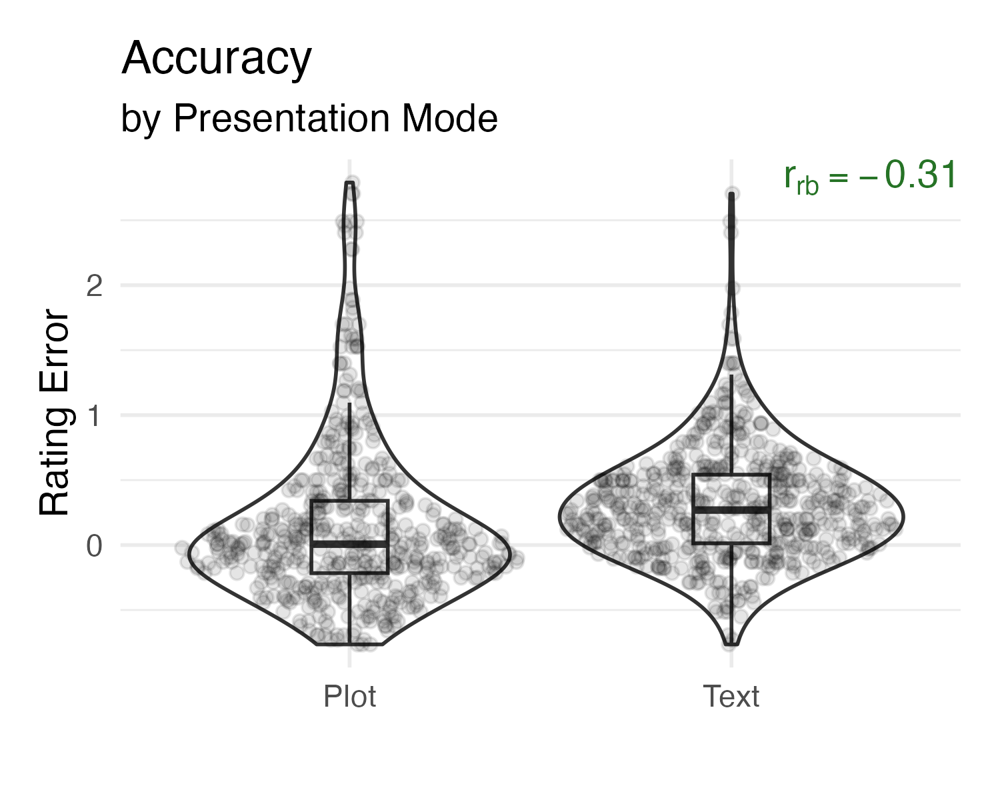{.lightbox width="100"}|


::: notes 
- Lehrpersonen können zwischen großen und kleinen Effekten unterscheiden -> wie auch vorher und daher verstärktes Argument für EffSize
- gerade mit geeigneten Visualisierungen z.B. neben Infos zur MW auch Streuung oder zusätzliche Annotationen gelingt es ihnen auch Effektsize erstaunlich akkurat einzuschätzen
  + neue Studie deutet darauf hin, dass BESD ein Ansatz sein könnte, hier Einschätzungen bei POS ziemlich akkurat

- In Literatur spricht man von common language effect sizes / translated effect sizes, um Effektgröße leichter verständlich aufzubereiten, aber bedeutet nicht gleich weit verständliche Effektstärke, 
  + z.B. viele Fehlkonzepte bei U3
  + trotzdem Schwierigkeiten zwischen Effsize und U3 zu unterscheiden (Anmerkung Disentangling -> Paralellität zu PSB)
  + was dazu führt, dass wirklich visuelle Ergänzungen hilfreich sein könnten

- ABER Visualisierungen und Text scheinen komplementäre Vor-und Nachteile zu haben: Viz akkuratere Einschätzungen, aber Text informativer, leichter verständlich (etwas informativer -> relevanter für die Praxis)


Zusatz:
- Overlap etwas weniger Bias, aber immer noch gebiased
::: 

## Limitation 

* Interpretation eine notwendige, aber nicht hinreichende Bedingung für gelingendes evidenzinformiertes Handeln 


<center>

_adapted_barriers_black.png){.lightbox width="400"} <br>

Eigene Adaption des Prozessmodells nach @grossophoff2023

</center>

::: notes
- möchte nochmals herauszoomen
- deutlich gemacht, dass trotz der Vorarbeiten es noch viel zu tun gibt
- die Interpretation von statistischen Informationen zwar notwendig, aber nicht hinreichend für gelingedes evidenzinformiertes Handeln
    + sie ist nur ein Faktor, der z.B. neben Überzeugungen, die Schlussfolgerung beeinflusst
    + und insgesamt ist die Schlussfolgerungsphase wiederum nur ein kleines Puzzleteil eines komplexen Prozesses
    + gerade auch der Bezug zur Nutzung muss stärker hergestellt werden

:::


## Referenzen
